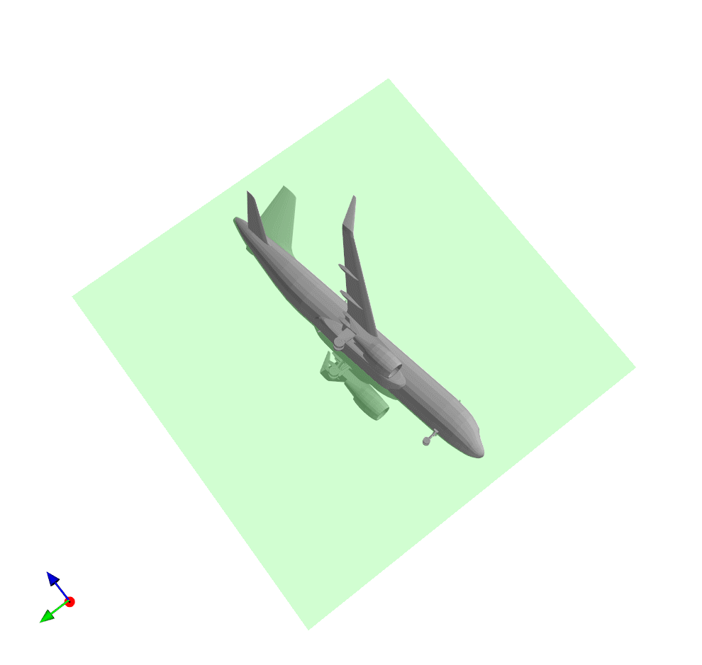

# PRS-Net

## Introduction
A pytorch implementation of PRS-Net, a research work on TVCG by Lin Gao et al.
Official link: http://geometrylearning.com/prs-net/

Author: D-Hank
Feel free to contact me at [daihankun19@mails.ucas.ac.cn](daihankun19@mails.ucas.ac.cn). To use my code, please cite the link of this repository.

## Dependencies

PCL 1.12.1: generate point cloud (poisson disk) {https://pointclouds.org/}

cuda_voxelizer: generate voxel (mesh split) {https://github.com/Forceflow/cuda_voxelizer}

Open3D: read pcd file in Python {http://www.open3d.org/}

Libigl: compute closest points on the mesh (barycentric coordinates) {https://github.com/libigl/libigl-python-bindings}

point_cloud_utils: read and write obj files {https://github.com/fwilliams/point-cloud-utils}

Mayavi / matplotlib: visualization {http://docs.enthought.com/mayavi/mayavi/}

**Note: ** The library cuda voxelizer should be localized for our model. We include the revised version in the directory `extern/`

## Directory

The project directory should be organized like this:
```

├── augment      # dataset after augmentation

├── data         # dataset after preprocess

├── shapenet     # original shapenet data

	├── 02691156

	└── ……

└── prsnet-repr  # main working directory

	├── checkpoint     # saved models

	└── ……
```

## Running Tips

Change your working directory to `prsnet-repr`. About 3 days and 80 GB free space are required. You can set the default options in `settings.py`.

To run this project from the start, first run `python augment.py` to generate augmented data. It takes one day to run on CPU.

Then run `python preprocess.py` to generate voxel, point cloud and closest points. We use 4 processes to run simultaneously, which takes around 2 days with CUDA acceleration.

Finally use `python main.py` to run the main program. It takes 0.5 hour to train.

If you'd like to use the pre-trained model in `checkpoint/`, then set `CONTINUE_` in `settings.py` to be True and run `main.py` directly.

## Results

For different categories in test set, we've achieved great results.
Reflective plane (with coordinate axes on the left-buttom corner):




For generalized objects, the rotation axis:


## Limitations

- Position of the rotation axes

  Motivated by [YuzhuoChen99](https://github.com/YizhuoChen99/PRS-Net)'s implementation, the model can only predict rotation axes near the original point. Even for the already-normalized shapenet dataset, the rotational center is not always near the origin. Therefore the model performs not so well (sometimes disturbed).

  The solution is to introduce a shift vector or use the generalized 4×4 rotation matrix.

- Problems with axis-angle representation

  Basically, the network can learn to use tricks for better performance. That is, it can randomly pick three orthogonal axes and set the rotational angle to be 0 or 2π. Then both the distance and regularized loss will be relatively low. So sometimes the training rotation loss looks like:

  

  After training for a long time, the network can get lazy for rotation. But there seems no good way to solve this.

## Acknowledgement

Quaternion: tiny reimplementation of pytorch3D for Quaternion

Pairwise-Cosine: https://github.com/pytorch/pytorch/issues/11202

Reference: He Yue's implementation {https://github.com/hysssb/PRS_net}

Reference: official release {https://github.com/IGLICT/PRS-Net}
